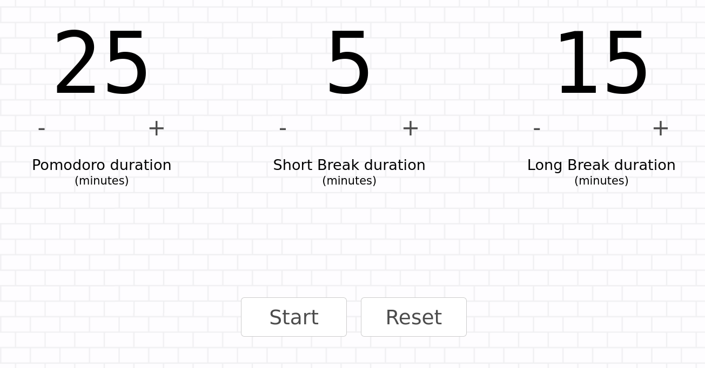
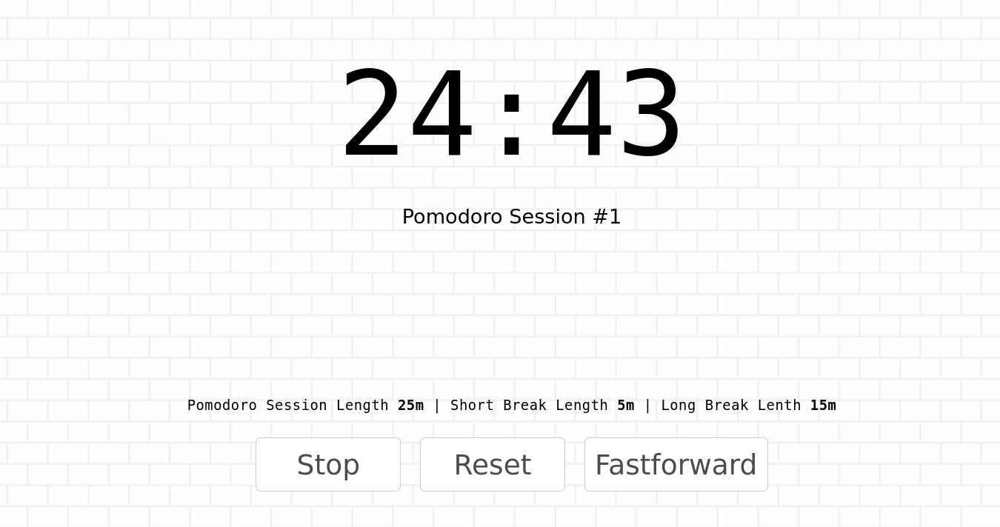

# Pomodoro

A simple [Pomodoro Timer](https://en.wikipedia.org/wiki/Pomodoro_Technique) implemented using Angular.

[Live Demo](http://namitjuneja.com/pomodoro)





## Get the Code
```
git clone https://github.com/namitjuneja/pomodoro.git
cd pomodoro
npm install
```

## Development server

Run `ng serve` for a dev server. Navigate to `http://localhost:4200/`. The app will automatically reload if you change any of the source files.

## Build

Run `ng build` to build the project. The build artifacts will be stored in the `dist/` directory. 

## Running unit tests

Run `ng test` to execute the unit tests via [Karma](https://karma-runner.github.io).

